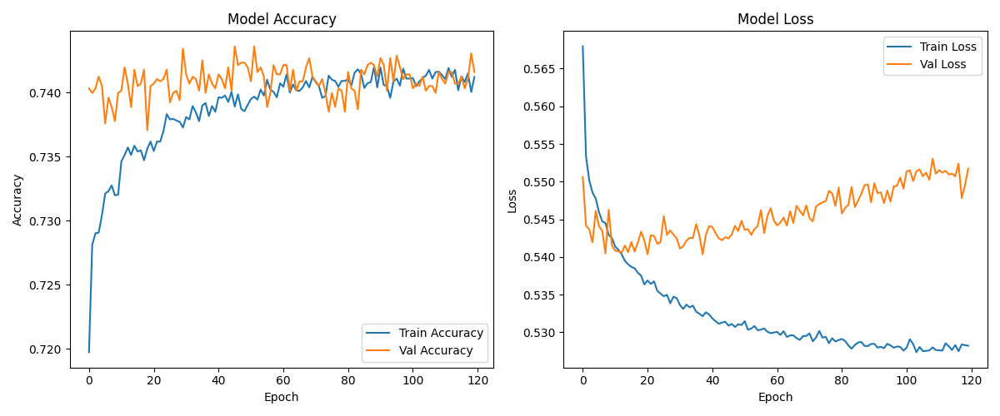

# AlphabetSoup Charity Optimization

##  Overview
This deep learning project aims to predict the success of funding applications to the nonprofit organization **AlphabetSoup**. By analyzing application data, we build and optimize a binary classification model that helps prioritize which applicants are most likely to yield successful outcomes.

---

##  Objective
Use TensorFlow/Keras to train a neural network that classifies donation success based on structured tabular data. The end goal is to support decision-making for funding allocation.

---

##  Dataset Details

- **Source:** edX Bootcamp Starter File  
- **Observations:** ~34,000 rows  
- **Target Variable:** `IS_SUCCESSFUL` (0 = Unsuccessful, 1 = Successful)  
- **Feature Types:** Categorical & Numerical

---

##  Data Preprocessing

- Dropped uninformative columns: `EIN`, `NAME`
- Applied one-hot encoding to categorical features
- Scaled numeric values with `StandardScaler`
- Split data: 80% training, 20% test

---

##  Model Architecture

| Layer | Neurons | Activation    |
|-------|---------|----------------|
| Input | 128     | LeakyReLU (α=0.01) |
| Hidden 1 | 64  | tanh           |
| Hidden 2 | 32  | LeakyReLU      |
| Hidden 3 | 16  | tanh           |
| Output | 1      | sigmoid        |

- **Loss Function:** `binary_crossentropy`
- **Optimizer:** `adam`
- **Epochs:** 120
- **Batch Size:** 32
- **Callbacks:** Model Checkpoint

---

##  Model Performance

| Metric | Value |
|--------|-------|
| Accuracy | *e.g., 72.4%* |
| Loss     | *e.g., 0.56*  |

###  Accuracy/Loss Over Time

---

##  Optimization Techniques

- Tested different:
  - Layer structures and neuron counts
  - Activation functions (`relu`, `tanh`, `LeakyReLU`)
  - Epochs and batch sizes
- Used `ModelCheckpoint` to retain the best weights

---

##  Key Learnings

- Deeper networks do not always improve accuracy
- Feature encoding and scaling are critical
- Accuracy plateaued below 75%, suggesting feature limitations or noise

---

##  Next Steps

-  Add dropout layers for regularization
-  Implement learning rate schedules
-  Try traditional ML models for comparison
-  Automate tuning with Keras Tuner

---

